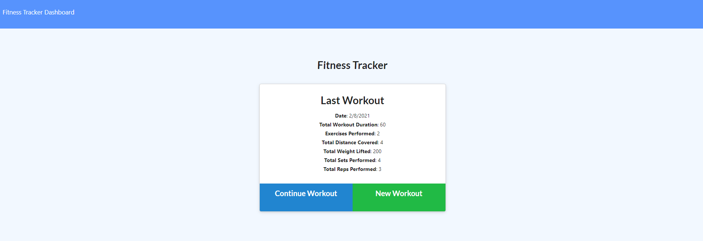

# Fitness Tracker

## Description

Application that will allow a user to keep track of workouts, and individual exercises within a specific workout.  Takes in user input to create workouts, and add exercises to workouts as completed.  Programmed in HTML, JavaScript, CSS, and data stored in MongoDB.  Uses Heroku to host web application and Mongo Atlas to connect to the Mongo database.

Deployed Site: [https://kyle-fitness.herokuapp.com/](https://kyle-fitness.herokuapp.com/)

## Table of Contents
* [Installation](#installation)
* [Usage](#usage)
* [License](#license)
* [Contributing](#contributing)
* [Tests](#tests)
* [Questions](#questions)

##  Installation

* Fork from the GitHub Repository: [https://github.com/Udunomancer/gt-ft-workout-tracker](https://github.com/Udunomancer/gt-ft-workout-tracker)
* Ensure that node is available on device
* Install packages, and configure local Mongo db to support local deployment
* Create Heroku application
* Create MongoDB cluster, and link user/database to Heroku using env variable
* Push files to Heroku application

##  Usage

* A user should be able to view the application by navigating to [https://kyle-fitness.herokuapp.com/](https://kyle-fitness.herokuapp.com/)
    * When clicking "Continue Workout", the user should be brought to the /exercise page to continue the most recent workout
    * When clicking "New Workout", the user should be brought to the /exercise page to add an entry to a new workout
* On the /exercise page the user should be able to enter details of either a "resistance" or "cardio" workout
    * Clicking "Add Exercise" will add the exercise to the workout, and remain on the page for new entries
    * Clicking "Complete" will add the exercise to the workout, and return to the main page
* Clicking "Dashboard" will bring the user to the /stats page, where they can view statistics of the 7 most recent workouts

##  License

[The MIT License](https://opensource.org/licenses/MIT)

##  Contributing

No public contributions accepted in this repository at this time.
If issues are found, please contact me using email/GitHub profile found in the Questions section below.

##  Tests

**The code on the frontend has multiple issues displaying the workout information on the stats page.  These issues were not planned to be addressed in code.**

To confirm functionality:
* Create new workouts from the main page
* Add exercises to workouts from the /exercise page
* Ensure that new workouts appear on the /stats page

##  Questions

Have questions?
* View my GitHub Profile: [https://github.com/Udunomancer](https://github.com/Udunomancer)
* Email me at: [kyle717@gmail.com](mailto:kyle717@gmail.com)